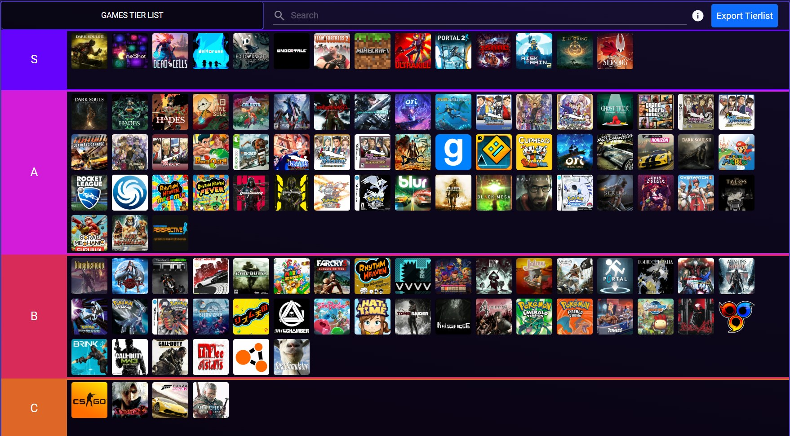
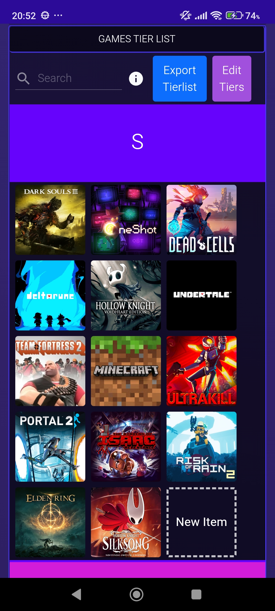
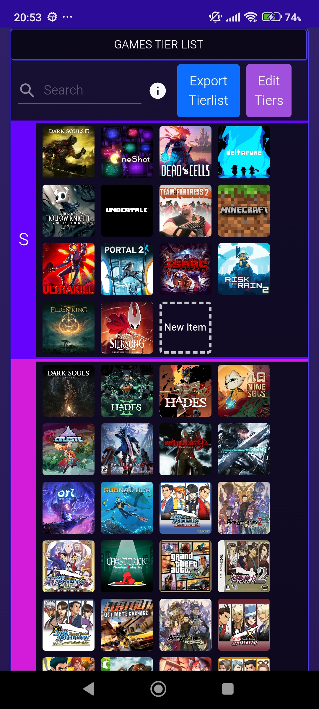
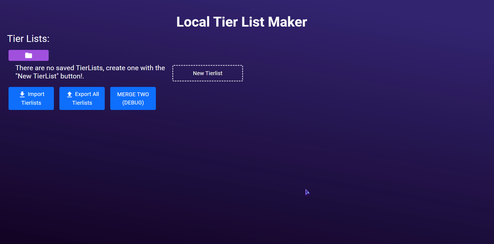
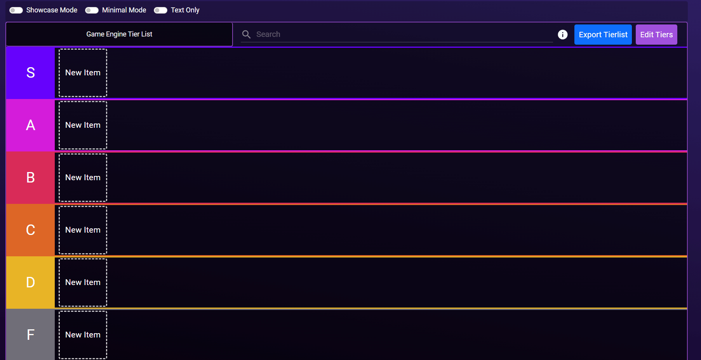
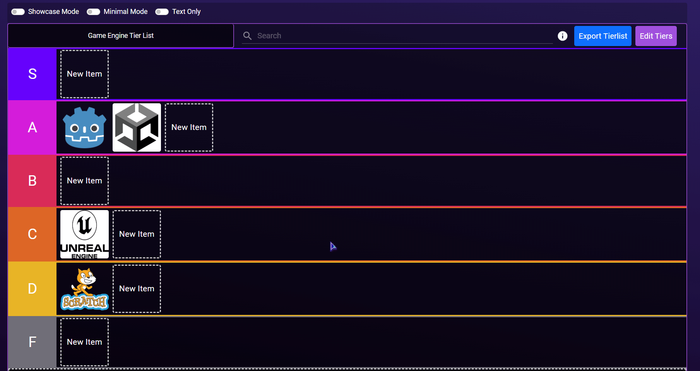
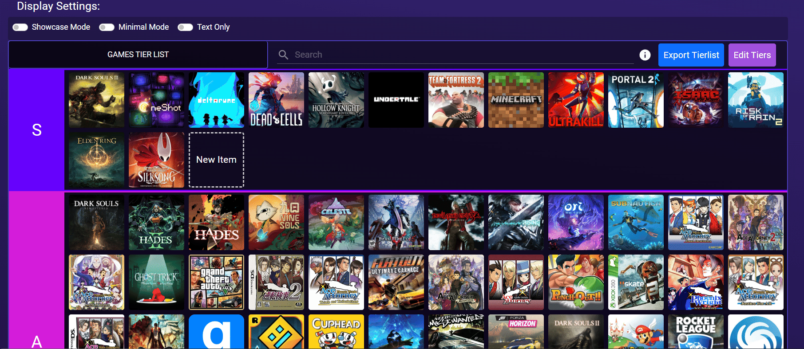
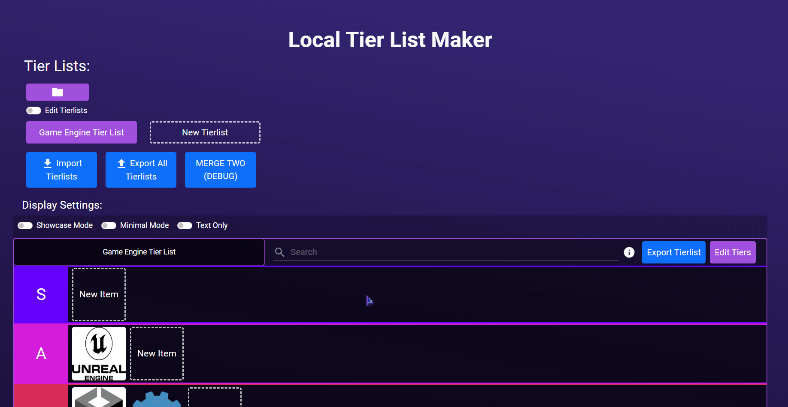
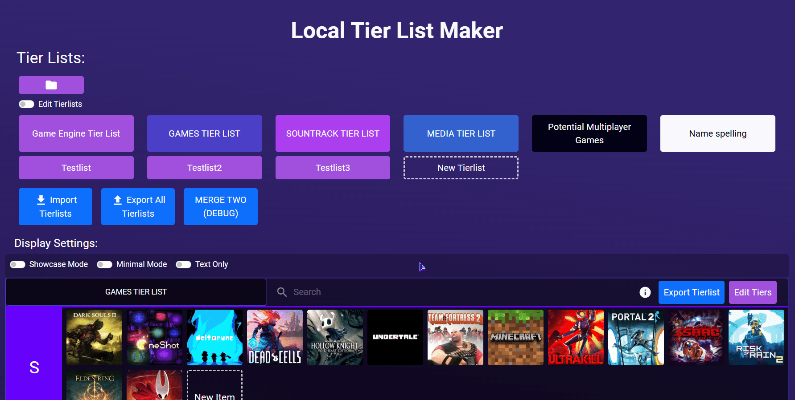

# Local Tier List

#### A simple Tier List Maker that can work without access to the internet, for both your desktop and your mobile device.   Mostly for tracking your opinions for yourself or to show them to your friends.

Main Tierlist View (Desktop)

</img>
  
Main Tierlist View (Mobile) (Scale can be changed with a switch)

</img>
</img>

## Features

### Creating a Tierlist
You can always create a new Tierlist, that is instantly stored locally. By default has tiers S to F.  

</img>

### Creating Items
While not in showcase mode, you can add items to any available tiers, they can have:
* Title
* Image link to be shown
* (Mobile only) Pick local image
* Tags (categories to be filtered)
* Notes (Description)
 

</img>

### Organizing Tierlist
You can drag and drop any item in any tier to another tier, or to another item, where it is then inserted. 

</img>

### Tierlist Display Settings
Above the tierlist there are 3 switches:
* Showcase Mode: this removes the buttons for adding new items or tiers, and shows a tooltip of the items when hovered.
* Minimal Mode: makes the items smaller and forces the conventional tierlist display. Good when your tiers have many items.
* Text Only: forces all items to display only as their titles. Can be used as a reference if the images are not recognizable enough.

</img>

### Tierlist Filtering
In the tierlist header there is a search bar, where you can specify a filter. Then only the items within that filter are shown.   Filter functions:
* <b>Title Search:</b> Plain text filters by title. Ex: "Dark" shows all items with "Dark" in the title (case-insensitive)
* <b>Tag Search:</b> Text inside [brackets] filters by tags. Ex "[Dark]" shows all items with the "Dark" tag (case-insensitive)
* <b>AND operation:</b> combine filters by separating them with "+". Ex: "Dark+Souls", "[Movie]+[Pixar]", "Devil+[3D]"
* <b>NOT operation:</b> exclude matches by prefixing a filter with "-". Ex: "-Dark" "-[Movie]". When combining with other filters, remember to add them first. "[Movie]+-[Pixar]".
* <b>OR operation:</b> match any of multiple filters by separating them with ",". Ex: "Dark, Light" "[Movie],[Short]" "Dark, [Movie]"

</img>

### Editing Tiers
With the "Edit Tiers" button, a menu shows up where you can change the name, color and position of each tier.

</img>

### Exporting Tierlists
With the "Export Tierlist" button, the JSON of the current tierlist gets copied to your clipboard, so it can be shared between people or between devices.   Additionally, theres an "Export All Tierlists" button that does the same but with all saved tierlists.

</img>

### Importing Tierlists
With the "Import Tierlist" button, you can paste the JSON of one or multiple tierlists, that are parsed and saved to your data.

</img>

### Tierlist Managing
When the "Edit tierlists" switch is on, you can:
* Change order of the tierlists (with drag and drop)
* Change color of the tierlists
* Delete tierlists

</img>

